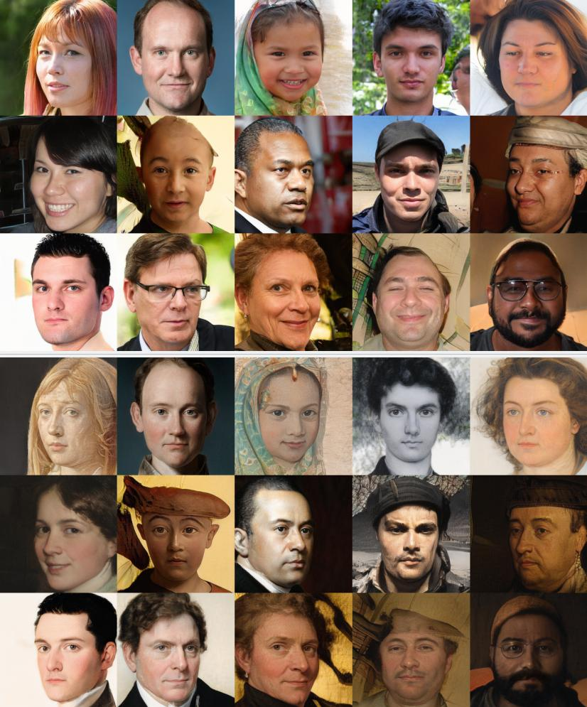

# StyleGAN2-ADA project

Results of the StyleGAN2-ADA finetuned on images of art (MetFaces dataset)



## 📋 Todo:
- [x] write introduction to the problem
- [x] create a minimal working example pytorch script of torch loading, file loading and file writing
- [x] add a preprocessing script which does the same preprocessing as FFHQ's method
- [x] implement custom DCGAN
  - [x] train on FFHQ dataset
  - [x] train on Celeba dataset
  - [x] trian on MetFaces dataset
- [x] implement custom StyleGAN
  - [x] train on FFHQ dataset
  - [x] train on Celeba dataset
  - [x] trian on MetFaces dataset
- [x] get minimal working example of projecting the image into latent space (latent space, final image, video of the interpolation between the initial and final image)
- [x] create script for linear interpolation of two images
  - [x] add gui slider
  - [x] add precompute/cache
- [x] explore latent space in a particular direction, change concrete features (pose, nose...) [link](https://amarsaini.github.io/Epoching-Blog/jupyter/2020/08/10/Latent-Space-Exploration-with-StyleGAN2.html#3.-Interpolation-of-Latent-Codes)
  - [x] change a particual dimension of W in hope of chaning a specific facial feature (works!)
  - [x] use trained latent directions (open_mouth, open_eyes...) and generate images new images
- [x] compare StyleGAN2 and StyleGAN2-ADA
  - [x] finetune both models on MetFaces (n = 1400)
  - [x] finetune both models on MetFaces (n = 100)
  - [x] compare images and FID metric for different kimg step
- [x] write a full PDF report
- [x] create a presentation
- [ ] add noise to latent vector at every level of projection to include randomness
- [ ] use W(1,18) instead of W(1) when projecting [link](https://colab.research.google.com/github/woctezuma/stylegan2-projecting-images/blob/master/stylegan2_projecting_images_with_my_fork.ipynb#scrollTo=beAa5YPrdqgs&uniqifier=2)
- [ ] take feature from a person? E.g. simple interpolation between faces A and B is always possible. But how can I add A's hair to B? Find a way to extract latent representation of A's hair and add it to B.


## 📁 Directory structure

| Directory                                     | Description                                       |
| --------------------------------------------- | ------------------------------------------------- |
| [conf](conf/)                                 | configuration files                               |
| [data](data/)                                 | datasets                                          |
| [models](models/)                             | model checkpoints, model metadata                 |
| [nvidia-stylegan2-ada](nvidia-stylegan2-ada/) | fork of the original stylegan2-ada implementation |
| [mini-stylegan](mini-stylegan)                | our own from scratch GAN implementation           |
| [figures](figures/)                           | figures                                           |
| [references](references/)                     | research papers                                   |
| [reports](reports/)                           | model checkpoints and model metadata              |
| [src](src/)                                   | python source code                                |

## ⬇️ Setup


### 🐳 Docker Notes:

Alias to get an ID of the current running stylegan2 docker container:
```
docker ps -a | grep $(whoami) | grep stylegan
```

**Build the Docker Image from a Dockerfile**:
- Build-args are arguments that are passed to the Dockerfile. These arguments are used to create the new user inside the docker container which has the same name and group as YOU (the current user). This is done to avoid permission issues.
- `-t` is the name of the Docker image which will be created

Fixed permissions version:
```
docker build \
--build-arg USER_ID=$(id -u) \
--build-arg GROUP_ID=$(id -g) \
--build-arg USER_NAME=$(id -un) \
--build-arg GROUP_NAME=$(id -gn) \
-t mciglenecki/stylegan2-ada .
```

No permissions version (If you can't run commands like `id -un` (e.g. you are on Windows), try running `docker build` without --build-args) : 
```
docker build -t mciglenecki/stylegan2-ada .
```

**Run the docker container**:
- `-ti` runs the Docker container in interactive mode (you get access to the shell)
- `-e` sets the enviroment variables. You should set `TCNN_CUDA_ARCHITECTURES` to the  Compute Capability. List of GPU's and their Compute Capability can be found at https://developer.nvidia.com/cuda-gpus. My GPU's Computer Capability is 6.1 so I set `TCNN_CUDA_ARCHITECTURES` to `61`
- `--name` is the name of the Docker Container which will be created
- `-v` stands for volume. Volume is a mapping between your local directory and directory in the Docker Container. Any changes inside of the directory (locally or inside of the Docker) will be reflect at the other directory. **Careful, this includes creating, editing and deleting files.**
- last argument `mciglenecki/stylegan2-ada` is the name of the Docker Image used for creating the Docker Container.
- `-v ~/projects/stylegan2-ada:<<DOCKER_DIR_LOCATION>>` where `<<DOCKER_DIR_LOCATION>>` is either:
  - `/home/$(whoami)/stylegan2-ada`: if you used `--build-arg` during Docker build
  - `/root/stylegan2-ada`: if you didn't use `--build-arg` during Docker build

Fixed permissions version:
```
docker run \
-ti --gpus device=0 \
-e TCNN_CUDA_ARCHITECTURES=<MY_GPU_COMPUTE_CAPABILITY> \
--name=$(whoami)-stylegan2-ada \
-v ~/projects/stylegan2-ada:/home/$(whoami)/stylegan2-ada \
mciglenecki/stylegan2-ada
```

No permissions version (difference is only at `-v`): 
```
docker run \
-ti --gpus device=0 \
-e TCNN_CUDA_ARCHITECTURES=<MY_GPU_COMPUTE_CAPABILITY> \
--name=$(whoami)-stylegan2-ada \
-v ~/projects/stylegan2-ada:/root/stylegan2-ada \
mciglenecki/stylegan2-ada
```

Exit docker container WITHOUT stopping it: `Ctrl + P, Ctrl + Q`

Exit docker container and stop it: `Ctrl + D`

Start docker container:
```
docker start <CONTAINER_ID> 
```

Connect to a running docker container:
```
docker attach <CONTAINER_ID> 
```

Connect to a running docker container in the new shell/session:
```
docker exec -ti -e COLUMNS="`tput cols`" -e LINES="`tput lines`" <CONTAINER_ID> bash
```

## 📝 Notes:

### Commands log

```bash
python nvidia-stylegan2-ada/train.py --resume ffhq256 --outdir outputs/metfaces-256 --data data/metfaces-aligned/images-256-tfrecords/ --cfg paper256 --batch 8 --aug noaug --gpus=1 --metrics none --kimg 40 --snap 1
```

```bash
python nvidia-stylegan2-ada/train.py --resume ffhq256 --outdir outputs/metfaces-256 --data data/metfaces-aligned/images-256-tfrecords/ --cfg paper256 --batch 8 --aug ada --gpus=1 --metrics none --kimg 40 --snap 1
```

```bash
python nvidia-stylegan2-ada/train.py --resume ffhq256 --outdir outputs/metfaces-256 --data data/metfaces-aligned/images-256-tfrecords/ --cfg paper256 --batch 8 --aug noaug --gpus=1  --kimg 100 --snap 1 --subset 100;
```


### Specs

GPU: Titan XP

### Latent space projection

Initial projection in latent space gave very bad results <IMAGE_OF_BAD_PROJECTION>. This happened because the preprocessing of the image was not done in the same way as FFHQ's preprocessing (TODO: describe FFHQ's preprocessing technique). Once the FFHQ's preprocessing was applied the lantet projection was better.

Projection to latent representation takes ~2 minutes (TODO: can we improve this?)

### StyleGAN2 vs StyleGAN2-ADA

- pretrained fhqq-256 StyleGAN2 finetuned to MetFaces (2h 5min = 125min)
- pretrained fhqq-256 StyleGAN2-ADA finetuned to MetFaces (2h 10min = 130min)

Exponential Moving Average (EMA)

Gs - Gan Slimming

### Reducing complexity of the generator ($g$) while trying to perserve the output quality

Goal: cut off or somehow reduce the total number of parameters of the $g$ generator
- we can the smaller generator to the larger generator, how does each generator perform on 56x56 images? Can we make the smaller generator better by trying to 'copy' the outputs of the larger generator (@jrukavina noted this might be an issue because features at the same block depth represent different things)

### Interpolation of latent features

Goal: control interpolation of multiple latent features (mesh multiple faces into one)
- easiest thing would be to take the average of latent features (e.g. 3 latent features and average them) and see the result
- I want to generate a human face with Dominik's facial structure and Fran's hair. Can we somehow control the features so that they impact low or high level features?

### Decomposing style $\mathbf{w}$ into $\mathbf{w_1}$ and $\mathbf {w_2}$

Goal: instead of one style vector, try to decompose it to $\mathbf{w_1}$ and $\mathbf{w_2}$ where $\mathbf{w_1}$ is a vector style which represents coarse level features (pose, facial structure) and  $\mathbf{w_2}$ which represents fine level details (hair, freckles)
- intuitively: $\mathbf{w_1}$ is active in the upper blocks and  $\mathbf{w_2}$ in the lower blocks
- to achieve this, fork MLP into 2 MLPs at the bottom, instead of one vector $w$ now we have two
- in the generator $g$, introduce scaler $\alpha$ which weighs each style $(1-\alpha) \mathbf{w_1} + (\alpha)\mathbf{w_2}$
  - layer 1: $\alpha = 0,\quad (1-\alpha) \mathbf{w_1} + (\alpha)\mathbf{w_2} = 1\cdot w_1 + 0 \cdot w_2 $
  - ...
  - layer $\frac{n}{2}$: $\alpha = 0.5,\quad (1-\alpha) \mathbf{w_1} + (\alpha)\mathbf{w_2} = \frac{1}{2} \cdot w_1 + \frac{1}{2}\cdot w_2 $
  - ...
  - layer $n$: $\alpha = 1,\quad (1-\alpha) \mathbf{w_1} + (\alpha)\mathbf{w_2} = 0 \cdot w_1 + 1\cdot w_2 $

### Mini StyleGAN
Goal: reimplement StyleGAN arhitecture which generates small images
- quite hard and time consuming, probably out of the scope of this project

## StyleGAN
- youtube video: https://youtu.be/kSLJriaOumA
- paper: https://arxiv.org/abs/1812.04948
- github: https://github.com/NVlabs/stylegan

<details><summary>
abstract
</summary>

We propose an alternative generator architecture for generative adversarial networks, borrowing from style transfer literature. The new architecture leads to an automatically learned, unsupervised separation of high-level attributes (e.g., pose and identity when trained on human faces) and stochastic variation in the generated images (e.g., freckles, hair), and it enables intuitive, scale-specific control of the synthesis. The new generator improves the state-of-the-art in terms of traditional distribution quality metrics, leads to demonstrably better interpolation properties, and also better disentangles the latent factors of variation. To quantify interpolation quality and disentanglement, we propose two new, automated methods that are applicable to any generator architecture. Finally, we introduce a new, highly varied and high-quality dataset of human faces.
</details>

## StyleGAN 2 - Analyzing and Improving the Image Quality of StyleGAN

- youtube video: https://youtu.be/9QuDh3W3lOY
- github: https://github.com/NVlabs/stylegan2
- paper: https://arxiv.org/pdf/1912.04958.pdf
- pretrained models and datasets: https://github.com/justinpinkney/awesome-pretrained-stylegan2

<details><summary>
abstract
</summary>
The style-based GAN architecture (StyleGAN) yields state-of-the-art results in data-driven unconditional generative image modeling. We expose and analyze several of its characteristic artifacts, and propose changes in both model architecture and training methods to address them. In particular, we redesign generator normalization, revisit progressive growing, and regularize the generator to encourage good conditioning in the mapping from latent vectors to images. In addition to improving image quality, this path length regularizer yields the additional benefit that the generator becomes significantly easier to invert. This makes it possible to reliably detect if an image is generated by a particular network. We furthermore visualize how well the generator utilizes its output resolution, and identify a capacity problem, motivating us to train larger models for additional quality improvements. Overall, our improved model redefines the state of the art in unconditional image modeling, both in terms of existing distribution quality metrics as well as perceived image quality.
</details>


## StyleGAN2-ADA - Training Generative Adversarial Networks with Limited Data

- github: https://github.com/NVlabs/stylegan2-ada-pytorch
- paper: https://arxiv.org/pdf/2006.06676.pdf
- data repository: https://nvlabs-fi-cdn.nvidia.com/stylegan2-ada-pytorch/
- lista pretreniranih modela i datasetova: https://nvlabs-fi-cdn.nvidia.com/stylegan2-ada-pytorch/pretrained/

<details><summary>
abstract
</summary>
Training generative adversarial networks (GAN) using too little data typically leads to discriminator overfitting, causing training to diverge. We propose an adaptive discriminator augmentation mechanism that significantly stabilizes training in limited data regimes. The approach does not require changes to loss functions or network architectures, and is applicable both when training from scratch and when fine-tuning an existing GAN on another dataset. We demonstrate, on several datasets, that good results are now possible using only a few thousand training images, often matching StyleGAN2 results with an order of magnitude fewer images. We expect this to open up new application domains for GANs. We also find that the widely used CIFAR-10 is, in fact, a limited data benchmark, and improve the record FID from 5.59 to 2.42.
</details>


## StyleGAN 3 - Alias-Free Generative Adversarial Networks

- website: https://nvlabs.github.io/stylegan3/
- paper: https://arxiv.org/pdf/2106.12423.pdf
- pretrained models: https://github.com/justinpinkney/awesome-pretrained-stylegan3


## 🏆 Team members

<table>
  <tr>
    <td align="center"><a href="https://github.com/francutura"><br /><sub><b>Fran Čutura</b></sub><br /></td>
    <td align="center"><a href="https://github.com/mirxonius"><br /><sub><b>Filip Mirković</b></sub></a><br /></td>
   <td align="center"><a href="https://github.com/ir2718"><br /><sub><b>Ivan Rep</b></sub></a><br /></td>
    <td align="center"><a href="https://github.com/dominik-matic"><br /><sub><b>Dominik Matić</b></sub></a><br /></td>
    <td align="center"><a href="https://github.com/jrukavina"><br /><sub><b>Jakov Rukavina</b></sub></a><br /></td>
    <td align="center"><a href="https://github.com/ciglenecki"><br /><sub><b>Matej Ciglenečki</b></sub></a><br /></td>
</table>
